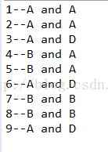
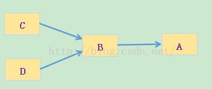

https://blog.csdn.net/jianyuerensheng/article/details/51602015


# 1 封装


 对于封装而言，一个对象它所封装的是自己的属性和方法，所以它是不需要依赖其他对象就可以完成自己的操作。使用封装有三大好处：

1、良好的封装能够减少耦合。
2、类内部的结构可以自由修改。
3、可以对成员进行更精确的控制。
4、隐藏信息，实现细节。

封装把一个对象的属性私有化，同时提供一些可以被外界访问的属性的方法，如果不想被外界方法，我们大可不必提供方法给外界访问。但是如果一个类没有提供给外界访问的方法，那么这个类也没有什么意义了。


```java
public class Husband {  
      
    /* 
     * 对属性的封装 
     * 一个人的姓名、性别、年龄、妻子都是这个人的私有属性 
     */  
    private String name ;  
    private String sex ;  
    private int age ;  
    private Wife wife;  
      
    /* 
     * setter()、getter()是该对象对外开发的接口 
     */  
    public String getName() {  
        return name;  
    }  
  
    public void setName(String name) {  
        this.name = name;  
    }  
  
    public String getSex() {  
        return sex;  
    }  
  
    public void setSex(String sex) {  
        this.sex = sex;  
    }  
  
    public int getAge() {  
        return age;  
    }  
  
    public void setAge(int age) {  
        this.age = age;  
    }  
  
    public void setWife(Wife wife) {  
        this.wife = wife;  
    }  
}  

```


# 2 继承


继承是使用已存在的类的定义作为基础建立新类的技术，新类的定义可以增加新的数据或新的功能，也可以用父类的功能，但不能选择性地继承父类。通过使用继承我们能够非常方便地复用以前的代码，能够大大的提高开发的效率。


同时在使用继承时需要记住三句话：

1、子类拥有父类非private的属性和方法。
2、子类可以拥有自己属性和方法，即子类可以对父类进行扩展。
3、子类可以用自己的方式实现父类的方法。（以后介绍）。

学习继承一定少不了这三个东西：构造器、protected关键字、向上转型

## 2.1 构造器

通过前面我们知道子类可以继承父类的属性和方法，除了那些private的外还有一样是子类继承不了的---构造器。对于构造器而言，它只能够被调用，而不能被继承。 调用父类的构造方法我们使用super()即可。

构建过程是从父类“向外”扩散的，也就是从父类开始向子类一级一级地完成构建。而且我们并没有显示的引用父类的构造器，这就是java的聪明之处：编译器会默认给子类调用父类的构造器。

但是，这个默认调用父类的构造器是有前提的：父类有默认构造器。如果父类没有默认构造器，我们就要必须显示的使用super()来调用父类构造器，否则编译器会报错：无法找到符合父类形式的构造器。

对于子类而已,其构造器的正确初始化是非常重要的,而且当且仅当只有一个方法可以保证这点：在构造器中调用父类构造器来完成初始化，而父类构造器具有执行父类初始化所需要的所有知识和能力。

对于继承而言，子类会默认调用父类的构造器，但是如果没有默认的父类构造器，子类必须要显示的指定父类的构造器，而且必须是在子类构造器中做的第一件事(第一行代码)。

## 2.2 protected关键字

private访问修饰符，对于封装而言，是最好的选择，但这个只是基于理想的世界，有时候我们需要这样的需求：我们需要将某些事物尽可能地对这个世界隐藏，但是仍然允许子类的成员来访问它们。这个时候就需要使用到protected。

对于protected而言，它指明就类用户而言，他是private，但是对于任何继承与此类的子类而言或者其他任何位于同一个包的类而言，他却是可以访问的。

## 2.3 向上转型

在上面的继承中我们谈到继承是is-a的相互关系，猫继承与动物，所以我们可以说猫是动物，或者说猫是动物的一种。这样将猫看做动物就是向上转型。

在这我们通过Person.display(husband)。这句话可以看出husband是person类型。

将子类转换成父类，在继承关系上面是向上移动的，所以一般称之为向上转型。由于向上转型是从一个叫专用类型向较通用类型转换，所以它总是安全的，唯一发生变化的可能就是属性和方法的丢失。这就是为什么编译器在“未曾明确表示转型”活“未曾指定特殊标记”的情况下，仍然允许向上转型的原因。

```java
1. public class Person {  

2.     public void display(){  

3.         System.out.println("Play Person...");  

4.     }  

5.       

6.     static void display(Person person){  

7.         person.display();  

8.     }  

9. }  

10.   

11. public class Husband extends Person{  

12.     public static void main(String[] args) {  

13.         Husband husband = new Husband();  

14.         Person.display(husband);      //向上转型  

15.     }  

16. }  

```


# 3 overload、override和overwrite的区别

https://blog.csdn.net/jianyuerensheng/article/details/51602015

overload意为重载，override意为覆盖，overwrite意为重写。从中文意思上看，并无差别，但是如下所示，给出英文定义：
- Overloading occurs when two or more methods in one class have the same method name but different parameters.
- Overriding or overwrite means having two methods with the same method name and parameters (i.e., method signature). One of the methods is in the parent class and the other is in the child class.

即overload为同一个类中，存在多个方法名相同的函数，但是他们拥有不同的参数（参数个数，类型，顺序）。
而 override 和 overwrite 为子类和父类之间，子类和父类拥有同样的方法名和参数列表，只是将方法体重写。这是面向对象编程的多态性。


# 4 多态

https://www.cnblogs.com/withyou/p/4789170.html

https://blog.csdn.net/jianyuerensheng/article/details/51602015

所谓多态就是指程序中定义的引用变量所指向的具体类型和通过该引用变量发出的方法调用在编程时并不确定，而是在程序运行期间才确定，即一个引用变量倒底会指向哪个类的实例对象，该引用变量发出的方法调用到底是哪个类中实现的方法，必须在由程序运行期间才能决定。因为在程序运行时才确定具体的类，这样，不用修改源程序代码，就可以让引用变量绑定到各种不同的类实现上，从而导致该引用调用的具体方法随之改变，即不修改程序代码就可以改变程序运行时所绑定的具体代码，让程序可以选择多个运行状态，这就是多态性。


## 4.1 基于继承实现的多态

基于继承的实现机制主要表现在父类和继承该父类的一个或多个子类对某些方法的重写，多个子类对同一方法的重写可以表现出不同的行为。

基于继承实现的多态可以总结如下：对于引用子类的父类类型，在处理该引用时，它适用于继承该父类的所有子类，子类对象的不同，对方法的实现也就不同，执行相同动作产生的行为也就不同。

如果父类是抽象类，那么子类必须要实现父类中所有的抽象方法，这样该父类所有的子类一定存在统一的对外接口，但其内部的具体实现可以各异。这样我们就可以使用顶层类提供的统一接口来处理该层次的方法。


---

```java
    public class A {  
        public String show(D obj) {  
            return ("A and D");  
        }  
      
        public String show(A obj) {  
            return ("A and A");  
        }   
      
    }  
      
    public class B extends A{  
        public String show(B obj){  
            return ("B and B");  
        }  
          
        public String show(A obj){  
            return ("B and A");  
        }   
    }  
      
    public class C extends B{  
      
    }  
      
    public class D extends B{  
      
    }  
      
    public class Test {  
        public static void main(String[] args) {  
            A a1 = new A();  
            A a2 = new B();  
            B b = new B();  
            C c = new C();  
            D d = new D();  
              
            System.out.println("1--" + a1.show(b));  
            System.out.println("2--" + a1.show(c));  
            System.out.println("3--" + a1.show(d));  
            System.out.println("4--" + a2.show(b));  
            System.out.println("5--" + a2.show(c));  
            System.out.println("6--" + a2.show(d));  
            System.out.println("7--" + b.show(b));  
            System.out.println("8--" + b.show(c));  
            System.out.println("9--" + b.show(d));        
        }  
    }  


```

 运行结果： 
 


①②③比较好理解，一般不会出错。④⑤就有点糊涂了，为什么输出的不是"B and B”呢？

    当超类对象引用变量引用子类对象时，被引用对象的类型而不是引用变量的类型决定了调用谁的成员方法，但是这个被调用的方法必须是在超类中定义过的，也就是说被子类覆盖的方法。（但是如果强制把超类转换成子类的话，就可以调用子类中新添加而超类没有的方法了。）

在继承链中对象方法的调用存在一个优先级：this.show(O)、super.show(O)、this.show((super)O)、super.show((super)O)。

上面程序中的A,B,C,D存在如下关系：




分析4：

a2.show(b)，a2是一个引用变量，类型为A，则this为a2，b是B的一个实例，于是它到类A里面找show(B obj)方法，没有找到，于是到A的super(超类)找，而A没有超类，因此转到第三优先级this.show((super)O)，this仍然是a2，这里O为B，(super)O即(super)B即A，因此它到类A里面找show(A obj)的方法，类A有这个方法，但是由于a2引用的是类B的一个对象，B覆盖了A的show(A obj)方法，因此最终锁定到类B的show(A obj)，输出为"B and A”。


分析5：

a2.show(c)，a2是A类型的引用变量，所以this就代表了A，a2.show(c),它在A类中找发现没有找到，于是到A的超类中找(super)，由于A没有超类（Object除外），所以跳到第三级，也就是this.show((super)O)，C的超类有B、A，所以(super)O为B、A，this同样是A，这里在A中找到了show(A obj)，同时由于a2是B类的一个引用且B类重写了show(A obj)，因此最终会调用子类B类的show(A obj)方法，结果也就是B and A。


分析8：

b.show(c)，b是一个引用变量，类型为B，则this为b，c是C的一个实例，于是它到类B找show(C obj)方法，没有找到，转而到B的超类A里面找，A里面也没有，因此也转到第三优先级this.show((super)O)，this为b，O为C，(super)O即(super)C即B，因此它到B里面找show(B obj)方法，找到了，由于b引用的是类B的一个对象，因此直接锁定到类B的show(B obj)，输出为"B and B”。
按照同样的方法我也可以确认其他的答案。

当超类对象引用变量引用子类对象时，被引用对象的类型而不是引用变量的类型决定了调用谁的成员方法，但是这个被调用的方法必须是在超类中定义过的，也就是说被子类覆盖的方法。这我们用一个例子来说明这句话所代表的含义：a2.show(b)；

这里a2是引用变量，为A类型，它引用的是B对象，因此按照上面那句话的意思是说有B来决定调用谁的方法,所以a2.show(b)应该要调用B中的show(B obj)，产生的结果应该是“B and B”，但是为什么会与前面的运行结果产生差异呢？这里我们忽略了后面那句话“被调用的方法必须是在超类中定义过的”，那么show(B obj)在A类中存在吗？根本就不存在！所以这句话在这里不适用？那么难道是这句话错误了？非也！其实这句话还隐含这这句话：它仍然要按照继承链中调用方法的优先级来确认。所以它才会在A类中找到show(A obj)，同时由于B重写了该方法所以才会调用B类中的方法，否则就会调用A类中的方法。


## 4.2 基于接口实现的多态

简单的说，就是用父类的引用指向子类的对象。多态可以理解成“一个接口，多种实现”，就是同一种事物表现出的多种形态，多态允许将子类的对象当作父类的对象使用，某父类型的引用指向其子类型的对象,调用的方法是该子类型的方法。

  把不同的子类对象都当作父类来看，可以屏蔽不同子类对象之间的差异，写出通用的代码，做出通用的编程，以适应需求的不断变化。
     

继承是通过重写父类的同一方法的几个不同子类来体现的，那么就可就是通过实现接口并覆盖接口中同一方法的几不同的类体现的。

在接口的多态中，指向接口的引用必须是指定这实现了该接口的一个类的实例程序，在运行时，根据对象引用的实际类型来执行对应的方法。

继承都是单继承，只能为一组相关的类提供一致的服务接口。但是接口可以是多继承多实现，它能够利用一组相关或者不相关的接口进行组合与扩充，能够对外提供一致的服务接口。所以它相对于继承来说有更好的灵活性。


```java
public abstract class Weapon {
    public void kill();// 让子类来运行
}

public Sword extends Weapon{
    @Override
    public void kill() {
        System.out.println("大刀向日本鬼子的头上砍去！");
    }
}

public Gun extends Weapon{
    @Override
    public void kill() {
        System.out.println("把子弹射入日本鬼子的头颅！);
    }
}

public class Soldier {
    private Weapon weapon;
    
    public Soldier(){}
    public Soldier(Weapon weapon){
        this.weapon = weapon;
    }
    public void setWeapon(Weapon weapon){
        this.weapon = weapon;
    }

    public void fight() {
        weapon.kill();
    }

    public static void main(String args[]) {
        Soldier soldier = new Soldier();
        Weapon sword= new Sword ();
        soldier.setWeapon(sword);
        soldier.fight();//1900年用大刀杀敌
        Weapon gun = new Gun();
        soldier.setWeapon(gun);
        soldier.fight();//1939年用小米加步枪杀敌
    }
}
```


多态可以用在什么地方呢?

可以用在方法的参数中和方法的返回类型中。

其中多态用于方法参数时上面给出了代码.我这里给出在方法的返回类型中如何使用多态。

上面的例子中,不管是Sword还是Gun都是我们自己直接new出来的.我们可以设计一个工厂类,专门生成武器


```java
public class WeaponFactory {
    public Weapon createWeapon(String year) {
        if (year.equals("1900")) {
            return new Sword();
        } else if (year.equals("1939")) {
            return new Gun();
        } else {
            return null;
        }
    }
}


public class Soldier {
    private Weapon weapon;
    
    public Soldier(){}
    public Soldier(Weapon weapon){
        this.weapon = weapon;
    }
    public void setWeapon(Weapon weapon){
        this.weapon = weapon;
    }

    public void fight() {
        weapon.kill();
    }

    public static void main(String args[]) {
        Soldier soldier = new Soldier();
        WeaponFactory weaponFactory = new WeaponFactory();
        Weapon sword= weaponFactory.createWeapon("1900");
        soldier.setWeapon(sword);
        soldier.fight();//1900年用大刀杀敌
        Weapon gun= weaponFactory.createWeapon("1939");
        soldier.setWeapon(gun);
        soldier.fight();//1939年用小米加步枪杀敌
    }
}
```

